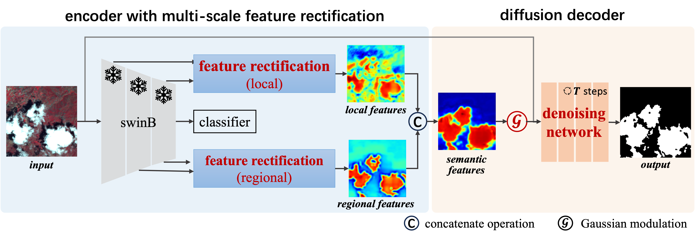

# CLDiff: Weakly Supervised Cloud Detection with Denoising Diffusion Probabilistic Models

## Abstract
Cloud detection plays a crucial role in remote sensing applications. To alleviate the annotation burden in fully supervised methods, weakly supervised cloud detection has received extensive attention recently. One standard approach performs cloud detection in a pixel-wise classification paradigm, which inevitably faces category ambiguity when detecting semitransparent clouds. To tackle this problem, we propose a novel weakly supervised cloud detection framework based on the diffusion model, termed CLDiff.

Here is a short implementation since the paper is under review. Further comprehensive details will be made available upon formal acceptance of the research paper.

## Dataset
GF-1 Cloud and Cloud Shadow Cover Validation Data: [link](URL "http://sendimage.whu.edu.cn/en/mfc-validation-data")

Landsat-8 Cloud Cover Assessment Validation Data: [link](URL "https://landsat.usgs.gov/landsat-8-cloud-cover-assessment-validation-data")

Sentinel-2 Cloud Mask Catalogue Data: [link](URL "https://zenodo.org/records/4172871")

## Training Phase
Please run ./scripts/main_train_CLDiff_GF1.py for model training.

## Testing Phase
Please run ./scripts/eval_CLDiff_DDIM_GF1.py.py to get model predictions. 
Then all patches are spliced to their original size for evaluation. 

## Framwork
The overall architecture of the CLDiff. CLDiff first uses an encoder with multi-scale feature rectification to generate
cloud activations. Subsequently, the diffusion decoder applies Gaussian modulation function to recalibrate ambiguous activations
around semitransparent clouds. Finally, these modulated activations serve as semantic guidance to optimize denoising network
and recall semitransparent clouds. Here, T steps represent the multi-times diffusion process in diffusion decoder.

